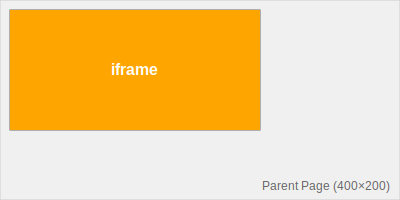
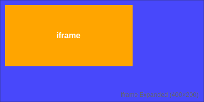

# Draggable Iframe with Message Passing

A simple demo showing how to make an iframe draggable using `postMessage`. The iframe expands to full screen while dragging for smooth movement, then shrinks back to its final position.

## Why Use This Pattern

**Problem**: Browser extension content scripts struggle with custom floating UI:

-  Host page CSS conflicts with your styles
-  Site overlays can block pointer events
-  Layout changes break your widget

**Solution**: Use an iframe for UI isolation:

-  Your CSS stays separate from the host page
-  Reliable pointer event handling
-  Still floats via `position: fixed`

**Challenge**: Dragging iframes is hard because pointer events get lost during fast movement.

**This Solution**:

-  Expand iframe to full viewport during drag (no clipped events)
-  Track movement inside the iframe only
-  Commit final position back to parent on drop

## How It Looks

| Initial State | Hover State |
|---------------|-------------|
|  |  |
| Small iframe (250×120) floating on page | Iframe expands to cover full screen |

| Drag State | Final State |
|------------|-------------|
|  |  |
| Orange handle follows your mouse | Iframe shrinks back at new position |

You never move the iframe directly during drag. You move a box inside the iframe, then commit that position back to the parent on drop.

## Files

-  `index.html` — Parent page that hosts the iframe.
-  `style.css` — Styles for the parent and the iframe element.
-  `script.js` — Parent-side message listener (applies `width/height/left/top`).
-  `iframe.html` — Iframe content variant (has `
iframe
`).
-  `iframeMain.html` — Alternative iframe content variant (similar to `iframe.html`).
-  `main.js` — Iframe-side logic to expand/shrink and track drag.

## Technical Details

**Message**: `resize` from iframe to parent  
**Data**: `{ width, height, x, y }`  
**Action**: Parent updates iframe styles

**Drag steps:**

1. pointerenter → expand iframe to full viewport
2. pointerdown → start drag, remember offset
3. pointermove → update handle position
4. pointerup → send final position, shrink iframe

## Getting Started

Open `index.html` in your browser. Hover the orange box, drag it around, and release. The iframe will snap to a small box at the drop position.

## Customization

-  **Iframe size**: Edit values in `main.js` and `#mainIframe` in `style.css`
-  **Handle appearance**: Modify styles in `iframe.html`
-  **Boundaries**: Add position clamping before sending resize messages

## License

MIT — see `LICENSE`.
